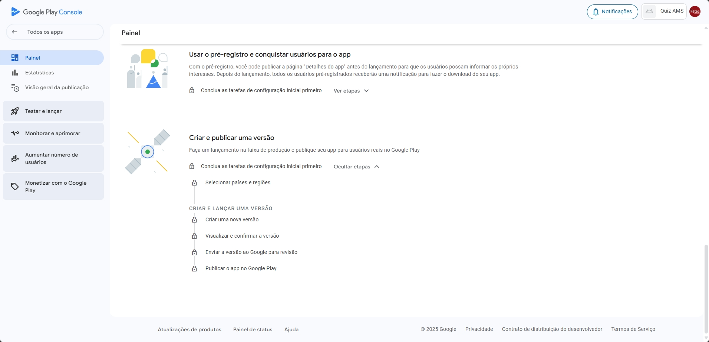

# 📖 Manual de como publicar na Google Play Console
Documentação criada para os alunos da Fatec Zona Leste publicarem seus aplicativos 

## **Links**
-  **Google Play Console (onde os apps são gerenciados:)**: https://play.google.com/console/u/0/developers
-  **Publicação para a  Apple Store:** https://github.com/JoaoEnrique/publicacao-apple-store

## **Modelos de imagens**
- Ícone (PNG ou JPEG de até 1 MB e 512 × 512px) - [Modelo no Canva](https://www.canva.com/design/DAGdfTpM8ek/L1qs4LzIVaPMOQKNRFU2nA/edit?utm_content=DAGdfTpM8ek&utm_campaign=designshare&utm_medium=link2&utm_source=sharebutton)
- Recurso Gráfico - banner do aplicativo (PNG ou JPEG de até 15 MB e 1024px × 500px) - [Modelo no Canva](https://www.canva.com/design/DAGL3T90bGo/7ql7RXW6mDOEtkugVoBIEA/edit?utm_content=DAGL3T90bGo&utm_campaign=designshare&utm_medium=link2&utm_source=sharebutton)
- Tela do Aplicativo - [Modelo no Canva](https://www.canva.com/design/DAGs0blP70w/CngI6ARr-KGa79a2WDyV9Q/edit?utm_content=DAGs0blP70w&utm_campaign=designshare&utm_medium=link2&utm_source=sharebutton)

## Aceitar Convite
Você receberá um email com o convite para participar da conta de desenvolvedor

Aceite os termos e clique em "Aceitar Convite", depois você será redirecionado para a tela inicial do [Google Play Console](https://play.google.com/console/u/0/developers)

## Tela inicial
Mostra todos os aplicativos aos quais você tem acesso:
[Google Play Console](https://play.google.com/console/u/0/developers)

Ao selecionar o aplicativo, é apresentado a tela de configuração do app que contém a lista de passos para a publicação na Play Store. Não é necessário preencher na ordem que é apresentado, caso não seja possível realizar uma etapa nesse momento, é possível pular para outra que não dependa da etapa atual.

 

# Etapas obrigatórias
- Começar a testar agora 
- Configurar o app
- Criar e Publicar uma versão

## Começar a testar agora
Os aplicativos devem passar por um teste realizado por você mesmo, com duração de 14 dias e com 12 pessoas. Por isso a primeira fase é adicionar uma lista com o e-mail dos testadores, mas não é necessário adicionar a lista nesse momento, podendo seguir para as demais configurações do app.

### Criar uma nova versão
A segunda fase consiste em criar uma nova versão do aplicativo, contendo o arquivo de build (.aab). Nessa etapa, é necessário definir o nome da versão (visível apenas internamente, para fins de controle), adicionar as notas da versão (que serão exibidas publicamente na Play Store) e, por fim, anexar o arquivo .aab.

### Visualizar e confirmar a versão
Por fim, basta avançar para visualizar um resumo geral e possíveis alertas de erro, caso existam. Para facilitar a visualização, expanda as mensagens e corrija os pontos indicados, se necessário.

 

# Configurar o app
Nesta etapa, você deverá fornecer todas as informações necessárias sobre o aplicativo. Elas não impedem a publicação do app, exceto se estiverem incorretas ou inconsistentes.

### Política de Privacidade
Na primeira opção, em 'Política de Privacidade', insira um link válido para a política de privacidade do seu app. A Play Store verifica se o link é acessível e, após algum tempo, também valida se o conteúdo corresponde de fato a uma política de privacidade. Por isso, é importante fornecer um link real e funcional.

### Acesso de apps
Nessa opção você informa se seu aplicativo é livre ou tem alguma funcionalidade restrita por meio de login e senha. Caso não tenha login, basta marcar a primeira opção e salvar.

Se seu aplicativo possuir sistema de login, é necessário informar um usuário e senha de teste e informações para a Play Store acessar e realizar testes

Ao clicar em “Adicionar instrução”, você deverá informar o nome da instrução, login e senha, e, se necessário, detalhes adicionais sobre como realizar o login.

Por fim, basta salvar.

### Anúncios
Na opção de anúncios, basta responder se seu aplicativo possui anúncios

### Classificações de conteúdo
A fase de “Classificações de conteúdo” é um formulário sobre o conteúdo do seu aplicativo e com base nas respostas a Play Store define a classificação de idade.

Adicione um email, informe a categoria do seu app e aceite os termos

Basta responder às perguntas conforme o conteúdo do seu aplicativo e visualizar um resumo com as informações para confirmação.

### Segurança dos dados
Na fase “Segurança dos dados”, você deverá informar quais dados o seu aplicativo coleta dos usuários (como nome, e-mail, nome de usuário, ID, entre outros) e explicar o motivo do uso de cada um deles.

Informe se o aplicativo coleta ou compartilha algum dado obrigatório, como email e senha.

Se houver dados obrigatórios, é preciso informar se os dados são criptografados por você e quais dados seu aplicativo coleta.

Ao marcar pelo menos um dado obrigatório, é preciso também informar um link onde o usuário possa excluir ou solicitar a exclusão da conta. (É possível adicionar o link onde o usuário possa ver seu perfil)

Se o seu aplicativo permite que o usuário exclua apenas determinados dados, você pode fornecer um link com essa funcionalidade. No entanto, essa etapa não é obrigatória. Depois de concluído, a opção “próximo” será liberada.

### Apps governamentais
Basta informar se seu aplicativo foi desenvolvido em nome de um órgão governamental. 

### Recursos financeiros
Informe se o seu aplicativo possui algum recurso financeiro, como serviços bancários e empréstimos. É possível marcar mais de um. Se não houver, marque a última opção: “Meu app não oferece recursos financeiros”

### Apps de saúde
Informe se o seu aplicativo possui algum recurso de saúde. É possível marcar mais de um. Se não houver, marque a última opção: “Meu app não tem recursos de saúde”

### Selecionar uma categoria do app e fornecer detalhes de contato
Aqui você pode adicionar a categoria do aplicativo, algumas tags, informações de contato públicas da Play Store e se o aplicativo pode ser anunciado fora da Play Store

### Configurar a página "Detalhes do app"
Detalhes do app é onde você define as informações públicas na Play Store, como ícone, nome, descrição e banner.

Crie uma breve descrição e uma descrição longa para seu aplicativo

Adicione um ícone e banner para aplicativo. Há um link de um modelo no Canva com o tamanho. É possível adicionar um link do YouTube

Ícone (PNG ou JPEG de até 1 MB e 512 × 512px) [Modelo no Canva](https://www.canva.com/design/DAGdfTpM8ek/L1qs4LzIVaPMOQKNRFU2nA/edit?utm_content=DAGdfTpM8ek&utm_campaign=designshare&utm_medium=link2&utm_source=sharebutton)

Recurso Gráfico - Banner (PNG ou JPEG de até 15 MB e 1024px × 500px) [Modelo no Canva](https://www.canva.com/design/DAGL3T90bGo/7ql7RXW6mDOEtkugVoBIEA/edit?utm_content=DAGL3T90bGo&utm_campaign=designshare&utm_medium=link2&utm_source=sharebutton)

É necessário adicionar de 2 a 8 capturas de tela de smartphone. No mínimo 1 de tela do tablet de 7 pol e 1 de tela de tablet de 10".
Modelo no Canva que atende a todos os tamanhos: [Link](https://www.canva.com/design/DAGs0blP70w/CngI6ARr-KGa79a2WDyV9Q/edit?utm_content=DAGs0blP70w&utm_campaign=designshare&utm_medium=link2&utm_source=sharebutton)

É possível adicionar de Chromebook e Android XR, mas não são obrigatórios

 

# Criar e publicar uma versão
Após todas as etapas estarem concluídas, a publicação será liberada, sendo necessário aguardar 14 dias com 12 pessoas testando o app diariamente.

